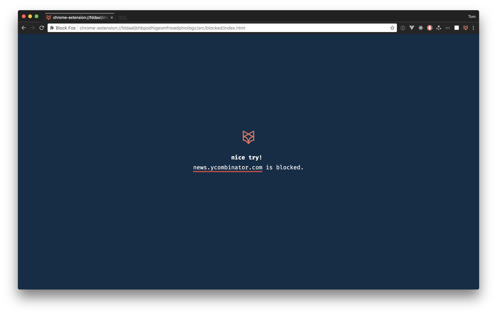
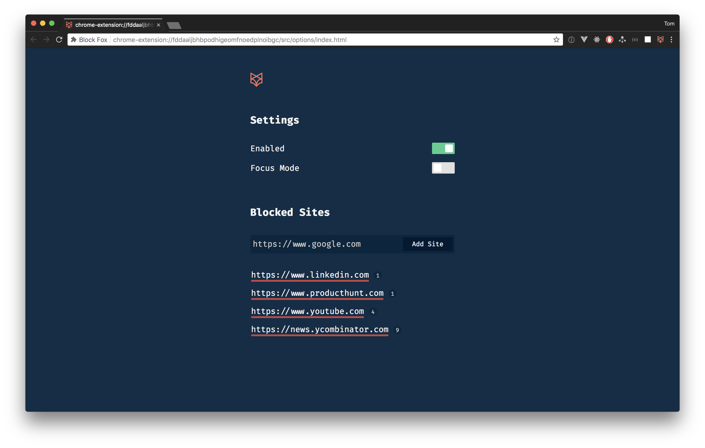
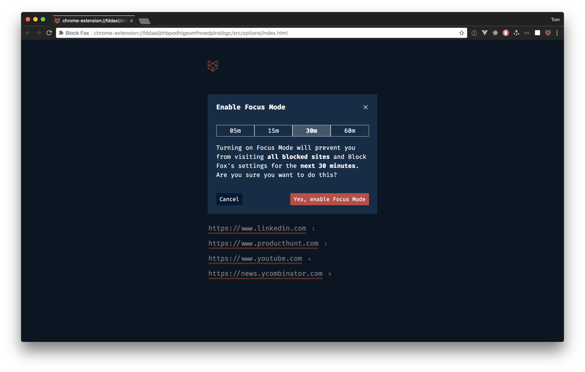
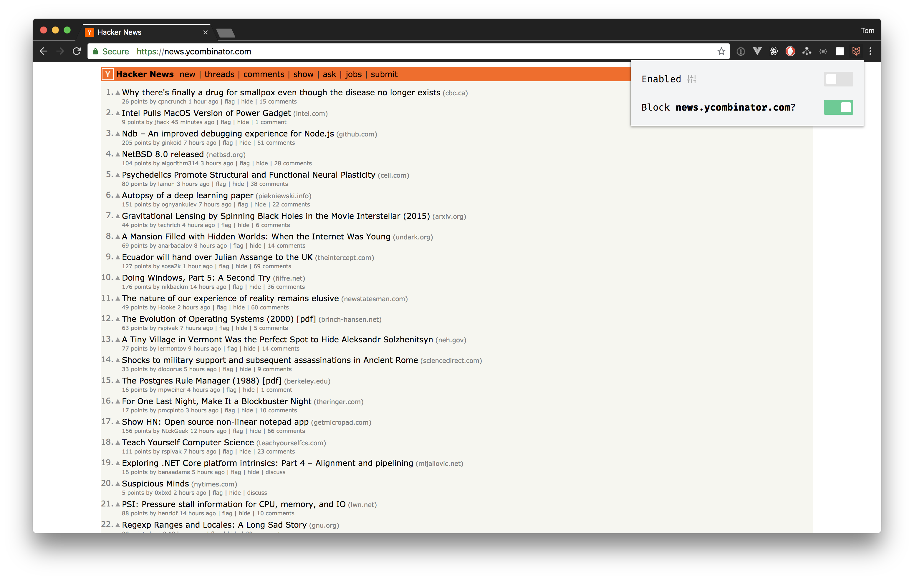

# Block Fox

Quickly block sites.

## Motivation

Couldn't find a Chrome extension to block sites that was easy to use. Wrote this really quickly in plain old JS after getting stuck in a YouTube vortex for a couple days.

## License

Released under the MIT license. See [LICENSE](https://github.com/tmm/block-fox/blob/master/LICENSE) for details.
